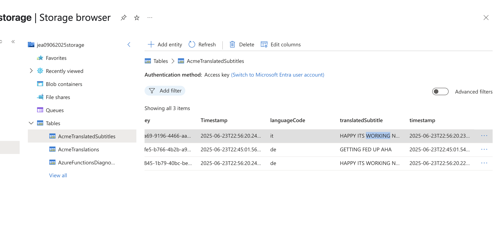

# DevOps Unit 8 Workshop

## Screenshots

### 1. Azure Storage Account Creation

_Setting up the Azure Storage Account for our Functions_

### 2. Function App Creation

_Creating the Azure Function App_

_Configuring the Function App settings_

### 3. Function Development and Deployment

_Successfully created Azure Functions_

_Functions deployed to Azure_

### 4. Queue Storage Setup

_Setting up the Azure Storage Queue for message processing_

_Queue processing logs showing message handling_

### 5. Data Storage and Processing

_Azure Table Storage showing processed data_

_Successful data storage in the output table_

### 6. Function Invocations and Monitoring

_Function invocation monitoring_

_Recent successful function executions_

### 7. Load Testing Results

_Initial load testing phase_

_Load testing results showing average response time of 30 seconds_

---

Welcome to the Unit 8 Workshop!

## Our objectives

The objectives for today are:

- Understand the different types of Cloud tooling (SaaS vs IaaS vs PaaS)
- Establish familiarity with using a public cloud platform (Azure) and provisioning resources
- Practice working with Serverless architectural design (using Azure Functions & Message Queues)

## Pre-flight checks

For this workshop, you'll want to have access to the following tools:

- [Visual Studio Code](https://code.visualstudio.com/download)
- [Git](https://git-scm.com/)
- [Python](https://www.python.org/downloads/)
  - We recommend Version 3.9 (up to 3.11); check this by running `python --version`
- [Azure CLI](https://docs.microsoft.com/en-us/cli/azure/install-azure-cli)
- There are two options for this workshop: Logic Apps and Azure Functions. If you do Azure Functions, you'll want [Azure Functions Core Tools version 4.x.](https://docs.microsoft.com/en-gb/azure/azure-functions/functions-run-local#v2)
  - The Function Tools are not required if you are following the alternative exercise
  - At time of writing, Azure function tools for Python works with Python 3.7-3.11 on x86(/64) only
    - If that isn't the version of Python you have installed, you can use an ACG cloud server, or use a dev container with the right version, or (if you know how) try GitHub Codespaces!

# Workshop Instructions

This workshop can be completed using two different services at the core.
You can use Azure Logic Apps, or Azure Functions.

- **Azure Logic Apps** is a low-code service that allows you to automate workflows and business processes.
- **Azure Functions** is a serverless compute service that lets you run event-triggered code without having to explicitly provision or manage infrastructure.

If you want to see even more of the PaaS side of the cloud, and workflows that you can only really use in the cloud, then try [Azure Logic Apps](workshop_instructions_azure_logic_apps.md).
If you want to get to use your Python skills and see how you can use serverless functions to do things, then try [Azure Functions](workshop_instructions_azure_functions.md).
